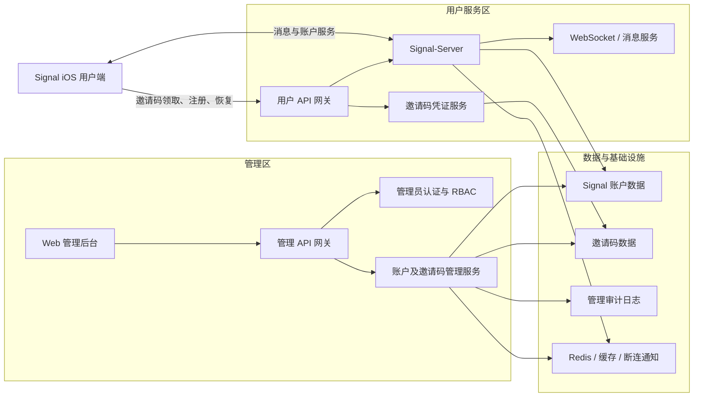

# Signal 无手机号邀请码注册与账户管理——需求开发设计

## 1. 文档目的

本文档描述基于现有 Signal-Server 与 Signal-iOS 建设一套私有、无手机号、受邀请码控制的账户系统所需的整体架构、产品边界、新增功能模块、实施阶段与工作量。

本文档不包含具体接口字段、数据库表结构、开发伪代码或实现代码。详细接口和数据设计应在各模块进入开发前另行评审。

## 2. 建设目标

- 用户不提供手机号，不进行短信或语音验证码验证。
- 使用随机密码学身份创建 Signal 账户。
- 新用户必须持有一次性邀请码。
- 一个邀请码最多创建一个账户，成功领取后永久失效。
- 用户使用 `Account ID + Recovery Key` 恢复已有账户。
- Username 只用于发现和联系，不作为登录或恢复凭证。
- iOS 强制设置独立应用密码。
- Face ID/Touch ID 作为可选快捷解锁方式。
- 应用进入后台后立即锁定。
- 管理员可以查询、暂停、停用和重新启用账户。
- 管理员可以批量生成、撤销、延期和审计邀请码。
- 管理操作必须具备权限控制和完整审计。
- 尽可能复用 Signal 已有 ACI、Recovery Password、Receipt Credential、Username、消息和设备体系。

## 3. 不在本期范围内的内容

- 不重新设计 Signal 端到端加密消息协议。
- 不将 Username 改造成传统用户名密码登录体系。
- 不提供手机号或客服人工恢复作为 Recovery Key 的替代方案。
- 不在 iOS 普通用户客户端内置管理员后台。
- 不允许管理员读取 Recovery Key、身份私钥、应用密码或消息明文。
- 不以删除账户代替可逆的暂停与重新启用。

## 4. 核心产品规则

1. 邀请码只用于首次创建账户。
2. 恢复已有账户不需要邀请码。
3. Account ID 是账户标识，不是秘密。
4. Recovery Key 是账户恢复根密钥，必须安全保存。
5. Username 可选、可修改，只用于用户发现。
6. 独立应用密码只保护当前设备，不能恢复账户。
7. Face ID/Touch ID 是独立应用密码的快捷解锁方式。
8. 不允许使用 iPhone 系统锁屏密码替代独立应用密码。
9. 应用进入后台后立即锁定，再次进入必须重新认证。
10. 被暂停或停用的账户不能通过恢复、设备链接或匿名发送绕过限制。

## 5. 总体架构



系统划分为四个边界：

1. **iOS 用户客户端**：负责注册、恢复、Username、应用锁及日常使用。
2. **Signal 用户服务**：负责无手机号账户、消息、设备认证和实时连接。
3. **邀请码凭证服务**：负责将一次性邀请码转换为 Signal Login 凭证。
4. **管理系统**：负责邀请码、账户状态、管理员权限和审计。

管理接口与普通 Signal 用户接口必须分离，建议使用不同域名、入口和认证体系。

## 6. 账户与身份架构

| 对象 | 作用 |
|---|---|
| Account ID / ACI | 账户永久标识 |
| Recovery Key | 账户根恢复密钥 |
| Registration Recovery Password | 从 Recovery Key 派生，用于服务端验证恢复资格 |
| Device Auth Credential | 当前设备访问服务端的认证凭证 |
| Username | 用户发现和联系标识 |
| Invite Code | 首次创建账户的资格凭证 |
| 独立应用密码 | 保护当前手机上的本地数据和应用入口 |
| TOTP/Passkey | 可选的账户恢复第二因素 |

整体关系：

```text
一次性邀请码
    ↓
匿名 LOGIN Receipt
    ↓
随机 Signal 账户 / Account ID
    ↓
Recovery Key
    ↓
可选 Username
```

用户日常使用已注册设备时，不需要反复输入 Account ID 和 Recovery Key。换设备或重新安装后，使用 `Account ID + Recovery Key` 恢复；若用户开启了二次验证，则同时验证 TOTP 或 Passkey。

## 7. 用户侧核心流程

### 7.1 新用户注册

```text
打开应用
    ↓
选择“使用邀请码创建账户”
    ↓
输入一次性邀请码
    ↓
创建随机账户
    ↓
保存并确认 Account ID + Recovery Key
    ↓
设置独立应用密码
    ↓
选择是否启用 Face ID/Touch ID
    ↓
设置昵称、头像和可选 Username
    ↓
进入应用
```

### 7.2 已有账户恢复

```text
打开应用
    ↓
选择“恢复已有账户”
    ↓
输入 Account ID + Recovery Key
    ↓
可选 TOTP/Passkey 验证
    ↓
仅恢复账户身份和 Username
    ↓
明确提示历史消息、附件和通话记录不会恢复
    ↓
为当前设备重新设置独立应用密码
    ↓
选择是否启用 Face ID/Touch ID
    ↓
进入应用
```

### 7.3 日常解锁

```text
应用切到后台
    ↓
立即遮挡并锁定
    ↓
重新进入
    ↓
Face ID/Touch ID 或独立应用密码
    ↓
进入聊天列表
```

## 8. iOS 客户端新增模块

### 8.1 无手机号注册入口

- 新增“使用邀请码创建账户”和“恢复已有账户”入口。
- 移除或通过构建配置关闭手机号、区号、短信和语音验证码流程。
- 建立统一注册模式配置，避免在业务代码中散落私有部署判断。

### 8.2 邀请码注册模块

- 邀请码输入页面。
- 邀请链接和二维码解析。
- 邀请码领取请求。
- 网络中断后的幂等重试。
- 邀请码不可用的统一错误提示。
- 注册中断后的继续机制。
- 注册完成后的敏感数据清理。

### 8.3 Signal Login 创建模块

- AccountEntropyPool/Recovery Key 生成。
- Registration Recovery Password 派生。
- LOGIN Receipt Credential 请求、接收与验证。
- 无手机号注册请求。
- 仅生成和上传 ACI 相关身份与 PreKey 材料。
- 处理无 E164、无 PNI 的账户响应。

### 8.4 Account ID 与 Recovery Key 管理

- 展示 Account ID 和 Recovery Key。
- 保存到系统密码管理器。
- 导出账户恢复文件或恢复二维码。
- 复制或手动保存。
- 随机分组确认，避免用户未保存便继续。
- 再次查看或导出时要求本地重新认证。
- 防止 Recovery Key 进入日志、分析、崩溃报告和普通存储。

### 8.5 无手机号本地账户模型

将本地身份模型从固定的 `ACI + PNI + E164` 扩展为：

```text
ACI + 可选 PNI + 可选 E164
```

需要兼容的主要区域包括：

- LocalIdentifiers。
- 注册响应和 WhoAmI。
- 单设备约束：禁止设备链接、换机数据迁移和跨设备历史同步。
- 账户设置和删除。
- 禁止消息、附件和通话记录导出、备份与恢复。
- 联系人发现。
- PNI 凭证和 Change Number。
- Storage Service。
- 地址展示和资料同步。

不得使用空字符串或虚假电话号码兼容旧逻辑。

### 8.6 账户恢复模块

- Account ID 和 Recovery Key 输入。
- Recovery Password 派生与账户恢复。
- 可选 TOTP/Passkey 验证。
- 明确禁止消息、附件和通话记录导出或恢复。
- 当前设备认证重建。
- 当前设备应用密码重新设置。
- Username 恢复或重新确认。
- 暂停或停用状态处理。

### 8.7 Username 适配

- 保留现有 Username 体系。
- 明确提示 Username 不属于登录凭证。
- 支持跳过、修改、二维码和 Username Link。
- 未创建 Username 时提示用户发现能力受限。

### 8.8 独立应用密码

- 注册后强制设置，不允许关闭。
- 支持数字密码和可选字母数字密码。
- 二次输入确认。
- 修改应用密码。
- 错误次数限制与递增等待。
- 忘记密码后的本机清除与账户恢复流程。
- 敏感操作二次认证。
- 安全保存密码验证材料。
- 建议参与本地数据库密钥保护，而不只是遮挡界面。

### 8.9 Face ID/Touch ID 改造

- 复用现有 Screen Lock 和 LocalAuthentication 能力。
- 改为纯生物识别策略，不自动降级到 iPhone 系统密码。
- 生物识别失败后使用独立应用密码。
- 生物识别集合变化后要求应用密码重新授权。
- Keychain 凭证仅限当前设备，不允许同步迁移。
- 用户可关闭生物识别，但不能关闭应用密码。

### 8.10 强制后台锁定

- 进入后台立即锁定。
- App Switcher 立即显示隐私遮罩。
- 冷启动和返回前台必须认证。
- 锁定时清除内存中的敏感密钥。
- 通知、Deep Link、分享扩展和敏感入口必须等待解锁。
- 正确处理系统弹窗、来电、控制中心和生物识别弹窗引起的生命周期变化。

### 8.11 账户状态界面

- 识别正常、暂停、停用和需要重新认证等状态。
- 显示适合用户理解的状态说明。
- 暂停期间禁止继续使用服务。
- 不将暂停误判为注销，不自动删除本地消息。
- 重新启用后恢复连接或重新认证。

## 9. Signal-Server 新增模块

### 9.1 邀请码领域模块

- 邀请码批次和单码记录。
- 密码学安全随机生成。
- HMAC 摘要存储，不保存可恢复明文。
- 有效期和状态管理。
- 原子领取和幂等响应。
- 撤销、延期和领取风控。
- 邀请码审计事件。

建议状态：

```text
AVAILABLE
CLAIMED
REVOKED
EXPIRED
```

已领取邀请码永久不能恢复为可用。

### 9.2 邀请码凭证签发模块

- 验证邀请码和 Receipt Credential Request。
- 原子标记邀请码已领取。
- 签发 Signal LOGIN Receipt。
- 保存幂等响应，支持网络中断重试。
- 防止一个邀请码签发多个凭证。
- 复用现有无手机号账户创建和 Receipt 兑换机制。

### 9.3 无手机号注册兼容完善

- 邀请凭证接入现有注册流程。
- 无 PNI 注册和无手机号响应。
- 无手机号账户恢复。
- 清理不必要的 PNI 恢复约束。
- 注册与恢复限流。
- Username 后续设置。
- 并发、幂等和错误响应测试。

### 9.4 账户访问状态

为账户增加独立状态：

```text
ACTIVE
SUSPENDED
DISABLED
PURGED
```

- `ACTIVE`：正常使用。
- `SUSPENDED`：临时暂停，可以重新启用。
- `DISABLED`：长期停用，需要更高权限重新启用。
- `PURGED`：已清理，不能恢复。

状态应独立于账户删除状态和设备注册状态。

### 9.5 全局权限拦截

账户状态检查必须覆盖：

- REST 和 gRPC 认证。
- WebSocket 建连和续期。
- 消息发送与获取。
- PreKey。
- Username。
- 设备链接。
- 账户恢复。
- 消息备份服务保持禁用，不能签发备份凭证或接收备份数据。
- 群组和通话相关凭证。
- 匿名发送凭证签发。

不能只在登录接口检查一次。

### 9.6 在线设备断连

暂停或停用账户时：

- 更新账户状态和状态版本。
- 清除认证缓存。
- 通过 Redis 通知所有服务实例。
- 断开全部设备 WebSocket。
- 停止新消息服务。
- 拒绝设备链接和账户恢复。
- 失效可失效的短期凭证。

现有 Redis 断连机制可扩展复用。

### 9.7 Sealed Sender 管控

Signal 的匿名 Sealed Sender 可能绕过普通账户认证检查。严格启停必须选择：

- **方案 A：强制认证发送**。实现较简单、管控明确，但降低发送者元数据隐私。
- **方案 B：可吊销匿名凭证**。保留更多隐私能力，但客户端、服务端和凭证体系改造更大。

建议第一阶段采用方案 A，稳定后再评估方案 B。

### 9.8 账户恢复保护

- 账户状态检查。
- Recovery Password 验证。
- 可选 TOTP/Passkey 验证。
- IP、设备和账户级限流。
- 统一错误响应，避免泄露 Account ID 是否存在。
- 暂停账户恢复阻断。
- 风险事件记录。

### 9.9 审计事件

标准化记录：

- 邀请码批次创建和导出。
- 邀请码撤销、延期和领取。
- 账户暂停、启用、停用和清理。
- 管理员登录和权限变化。
- 高风险操作及其失败记录。

审计日志与普通业务日志分离，并设置独立保留策略。

## 10. Web 管理后台新增模块

### 10.1 管理员登录

- 接入 OIDC 或企业身份源。
- 管理员二次验证。
- 会话超时与强制退出。
- 登录设备和 IP 记录。
- 管理员账户停用。

### 10.2 角色与权限

| 角色 | 主要权限 |
|---|---|
| 邀请码运营 | 创建、导出、撤销和延期邀请码 |
| 账户运营 | 查询、暂停和启用账户 |
| 安全审计员 | 查看和导出审计记录 |
| 超级管理员 | 管理角色及系统策略 |

高风险操作要求再次认证，可按需要增加双人审批。

### 10.3 仪表盘

- 总账户数和活跃账户数。
- 暂停与停用账户数。
- 新注册趋势。
- 邀请码可用、已领取、过期和撤销数量。
- 注册失败和异常领取趋势。

仪表盘不得展示消息内容和任何用户秘密。

### 10.4 邀请码批次管理

- 创建批次和设置数量。
- 设置有效期、名称和内部备注。
- 一次性导出完整邀请码。
- 查看批次统计和单码状态。
- 撤销未领取邀请码。
- 延长未领取邀请码有效期。
- 查看创建人、领取时间和操作历史。

### 10.5 账户管理

- 按 Account ID、Username、状态、时间等条件查询。
- 查看账户状态、注册时间、最后活动时间和设备摘要。
- 查看二次验证是否开启。
- 查看状态变更和管理员操作记录。
- 暂停、启用、长期停用和高权限清理。
- 强制断开全部设备。

不得展示 Recovery Key、身份私钥、消息内容、应用密码或完整设备认证凭证。

### 10.6 账户启停操作

- 要求选择原因并填写备注。
- 明确区分可逆暂停和不可逆清理。
- 高风险操作二次确认或审批。
- 记录操作管理员和操作前后状态。
- 普通暂停不得删除用户数据。

### 10.7 审计日志

- 按管理员、操作类型、Account ID、邀请码批次和时间筛选。
- 查看操作前后状态。
- 导出审计报告。
- 普通管理员不可修改或删除审计记录。

## 11. 管理 API 与安全边界

建议使用独立入口：

```text
chat.example.com       普通用户 API
admin-api.example.com  管理 API
admin.example.com      管理后台
```

管理 API 包含：

- 邀请码批次和状态管理。
- 账户查询和启停。
- 设备断连。
- 审计查询。
- 管理员角色和策略管理。

安全要求：

- 不接受普通 Signal 账户认证。
- 使用 OIDC、RBAC，并建议结合 mTLS、VPN 或 IP Allowlist。
- 所有写操作记录审计。
- 防止对象级和批量越权。
- 高风险接口单独限流和二次认证。

## 12. 数据模块

### 12.1 邀请码数据

- Invite Batch。
- Invite Record。
- Invite Claim。
- Idempotency Record。
- Invite Audit Event。

邀请码数据库只保存带服务端 Pepper 的 HMAC 摘要，不保存可恢复明文。完整邀请码只在生成或导出时展示一次。

### 12.2 账户状态数据

- Access State。
- State Version。
- Changed At。
- Changed By。
- Reason Code。
- Internal Note。
- Optional Expiration。

状态版本用于缓存失效、会话控制和凭证吊销。

### 12.3 管理数据

- Admin Identity。
- Role 和 Permission。
- Admin Session。
- Audit Event。
- Approval Record。
- Operation Comment。

管理身份与普通 Signal 用户账户应使用不同认证域。

## 13. 邀请关系的隐私选择

### 13.1 隐私优先模式（推荐）

```text
邀请码 → 匿名 LOGIN Receipt → ACI
```

管理员知道邀请码和批次是否被领取，但不能直接从邀请码定位最终账户。这种模式不形成长期邀请关系图，更符合 Signal 的隐私方向。

### 13.2 强运营模式

保存 `Invite ID → Account ID` 关联，便于渠道追踪和直接处置账户，但会降低匿名性，并削弱匿名 Receipt 的隐私价值。

### 13.3 建议

默认采用隐私优先模式。如果业务确实需要来源分析，优先保存批次级统计，而不是永久保存单个邀请码与 ACI 的关联。

## 14. 安全加固

### 14.1 传输安全

当前 iOS fork 中存在放宽 TLS/ATS 的配置，正式上线前必须：

- 移除 `trustAll`。
- 禁止明文 HTTP。
- 恢复完整证书验证。
- 使用 HTTPS/WSS。
- 评估证书固定。
- 为管理 API 建立更严格的网络边界。

### 14.2 敏感数据保护

敏感数据包括邀请码明文、Recovery Key、Receipt Credential、应用密码验证材料、设备认证密码和管理员 Token。

统一要求：

- 不写日志、分析和崩溃报告。
- 不长期停留系统剪贴板。
- 静态加密。
- 最小权限访问。
- 明确保留周期。
- 密钥进入专用 Secret/KMS 管理体系。

### 14.3 防滥用

- 邀请码尝试限流。
- Account ID 恢复限流。
- IP 和设备风险控制。
- 通用错误响应。
- 并发消费和重放保护。
- 管理员批量操作限制。
- 异常行为监控与告警。

## 15. 运维与部署

需要新增或调整：

- 管理后台和管理 API 部署。
- 邀请码数据库和索引。
- 账户状态字段迁移。
- Redis 状态广播。
- 管理员身份服务。
- 审计日志存储。
- 密钥和 Pepper 管理。
- 告警规则和运营监控。
- 服务端配置和管理数据的灾难恢复；不包含用户消息、附件或通话记录。
- 灰度发布、回滚和动态功能开关。

建议功能开关：

```text
numberlessRegistrationEnabled
inviteRegistrationEnabled
phoneRegistrationEnabled
strictAccountSuspensionEnabled
mandatoryAppLockEnabled
sealedSenderPolicy
adminConsoleEnabled
```

## 16. 测试范围

### 16.1 iOS

- 邀请码注册和中断恢复。
- Account ID/Recovery Key 保存确认。
- 无 E164、无 PNI 全流程。
- 账户身份恢复，且确认历史记录保持为空。
- 独立应用密码。
- Face ID/Touch ID。
- 后台立即锁定。
- 通知、Deep Link 和扩展。
- 暂停与重新启用。

### 16.2 服务端

- 邀请码生成、摘要和有效期。
- 并发领取和幂等重试。
- Receipt 签发与重复兑换。
- 无手机号注册和恢复。
- 账户状态全局拦截。
- WebSocket 断连和缓存失效。
- Sealed Sender 绕过测试。
- 管理 API 越权测试。
- 审计完整性。

### 16.3 安全

- 邀请码枚举与重放。
- Recovery Key 泄露面。
- 管理员权限提升和对象越权。
- 并发竞争。
- 日志敏感信息泄露。
- TLS 中间人。
- 本地数据库提取。
- 生物识别降级。
- 修改客户端绕过账户暂停。

## 17. 分阶段开发计划

### 17.1 阶段划分原则

本项目采用“阶段开发、阶段验收、通过后再进入下一阶段”的方式实施。每个阶段应满足以下规则：

- 每个阶段只处理本阶段定义的功能范围，不提前混入后续业务功能。
- 每个阶段开始前确认需求边界、数据影响和兼容策略。
- 每个阶段完成后必须提供代码变更说明、测试结果、已知限制和回滚说明。
- 当前阶段验收不通过时，不开始依赖它的下一阶段。
- 影响账户数据结构或协议的变更必须具备兼容和迁移方案。
- 所有新增能力优先使用功能开关控制，避免未完成链路影响现有环境。

建议执行顺序：


阶段 1 与阶段 2 的部分基础研究和测试准备可以并行，但端到端联调必须在两者分别验收后进行。阶段 7 可以在阶段 6 的管理 API 契约稳定后开始前端开发。

### 17.2 阶段 0：基线确认与技术准备

#### 目标

建立可重复构建、可测试、可回滚的开发基线，冻结关键架构选择，避免在开发中途反复改变账户模型。

#### 开发范围

- 确认 Signal-iOS 与 Signal-Server 当前版本和分支基线。
- 确认本地、测试和预发布环境的构建与部署方式。
- 梳理现有无手机号注册、Receipt Credential、Recovery Password 和 Username 能力。
- 建立客户端与服务端的功能开关框架。
- 确定手机号注册是完全移除，还是保留为关闭状态的兼容模式。
- 确定邀请码与最终 Account ID 是否建立关联，默认采用隐私优先模式。
- 确定 Sealed Sender 第一阶段采用强制认证发送还是可吊销匿名凭证。
- 建立测试账户、测试数据和基础联调环境。
- 形成数据迁移、协议兼容和回滚原则。

#### 交付物

- 技术基线记录。
- 构建与运行说明。
- 功能开关清单。
- 关键架构决策记录。
- 初始测试计划和阶段验收模板。

#### 验收门槛

- iOS 与 Server 均能从指定基线稳定构建。
- 测试环境可以完成现有账户注册和基本消息收发。
- 关键架构选择不存在未决阻塞项。
- 后续数据结构和 API 修改具备明确的兼容边界。

#### 工作量级别

小到中。

### 17.3 阶段 1：服务端无手机号账户基础

#### 目标

确认并完善 Signal-Server 已有的无手机号账户创建与恢复能力，为 iOS 和邀请码链路提供稳定服务端基础。

#### 开发范围

- 验证现有 LOGIN Receipt 无手机号注册分支。
- 验证随机 ACI 创建、无 E164、无 PNI 的账户存储与返回。
- 完善无手机号账户响应契约。
- 验证 Recovery Password 的生成、存储和恢复校验。
- 调整无手机号账户恢复时不合理的 PNI 约束。
- 补充注册、恢复、重复请求和并发场景测试。
- 为无手机号注册增加独立功能开关和监控指标。
- 统一无手机号注册与恢复的错误响应。

#### 交付物

- 可独立验证的服务端无手机号注册能力。
- 可独立验证的 Account ID + Recovery Password 恢复能力。
- 服务端自动化测试。
- 注册和恢复接口契约说明。
- 配置与监控说明。

#### 验收门槛

- 无手机号账户能够成功创建，返回 ACI 且不产生 E164/PNI。
- 相同 Receipt 不能创建多个账户。
- 合法幂等重试不会产生重复账户。
- 正确 Recovery Password 可以恢复账户，错误凭证不能恢复。
- 原有手机号账户能力在保留时不受影响。

#### 本阶段不包含

- 邀请码生成和领取。
- iOS 用户界面。
- 账户暂停和管理后台。

#### 工作量级别

中。

### 17.4 阶段 2：iOS 无手机号账户模型与基础注册能力

#### 目标

消除 iOS 对本机账户必须存在手机号和 PNI 的核心假设，使客户端能够正确保存和使用无手机号账户。

#### 开发范围

- 将本地账户标识扩展为 ACI、可选 PNI、可选 E164。
- 调整注册响应、WhoAmI 和账户状态解析。
- 调整身份密钥和 PreKey 生成逻辑，使新账户可以只使用 ACI 材料。
- 增加无手机号注册请求类型。
- 接入 AccountEntropyPool 和 Registration Recovery Password。
- 完成本地 Account ID、Recovery Key 和设备凭证的安全持久化。
- 兼容设置、Storage Service 和账户删除等关键路径；设备链接、换机数据迁移和跨设备历史同步保持禁用，现有消息备份代码保持禁用且不得因无手机号账户崩溃。
- 禁止通过虚假号码或空字符串模拟无手机号账户。
- 补充无手机号模型单元测试和回归测试。

#### 交付物

- iOS 无手机号账户数据模型。
- iOS 基础无手机号注册网络能力。
- Account ID/Recovery Key 基础存储能力。
- 受影响模块清单和兼容说明。
- 单元测试与基础集成测试。

#### 验收门槛

- iOS 能解析并保存服务端返回的无手机号账户。
- 应用重启后仍能加载该账户，不依赖虚假 E164。
- 基本消息、设置和账户状态读取不因缺少 E164/PNI 崩溃。
- 原有手机号账户在保留时可以正常运行。
- Recovery Key、恢复密码和设备凭证不出现在日志中。

#### 本阶段不包含

- 完整邀请码页面和管理能力。
- 正式用户注册引导。
- 独立应用密码。
- 管理员启停账户。

#### 工作量级别

很大。

### 17.5 阶段 3：一次性邀请码端到端注册

#### 目标

实现从管理员生成邀请码，到用户在 iOS 上凭邀请码创建一个无手机号账户的完整闭环。

#### 开发范围

服务端：

- 邀请码批次和邀请码记录。
- 安全随机生成和 HMAC 摘要存储。
- 邀请码状态、有效期、撤销和延期基础能力。
- 邀请码领取接口。
- 邀请码到 LOGIN Receipt 的匿名凭证签发。
- 原子领取、并发保护和幂等响应。
- 尝试限流、通用错误和敏感日志过滤。

iOS：

- “使用邀请码创建账户”入口。
- 邀请码输入、链接和二维码识别。
- Receipt Credential Request、Response 验证和 Presentation。
- 完整无手机号注册请求。
- 注册中断和网络失败后的继续机制。
- Account ID/Recovery Key 展示、保存和确认。
- 基础昵称和 Username 引导入口。

#### 交付物

- 邀请码服务端模块。
- iOS 邀请码注册流程。
- 邀请码基础管理命令或受控内部接口，供本阶段测试使用。
- 端到端自动化和并发测试。
- 邀请码运行与故障处理说明。

#### 验收门槛

- 一个有效邀请码能够创建一个无手机号账户。
- 一个邀请码无法签发多个有效 LOGIN Receipt。
- 一个 Receipt 无法创建多个账户。
- 网络中断重试不会错误消耗第二个邀请码或创建第二个账户。
- 过期、撤销、无效和已领取邀请码均不能再次使用。
- 完整流程不要求用户提供手机号。
- 用户能够保存并确认 Account ID 和 Recovery Key。

#### 本阶段不包含

- 正式 Web 管理后台。
- 账户暂停和启用。
- 完整独立应用密码保护。

#### 工作量级别

大。

### 17.6 阶段 4：账户身份恢复与 Username 完整闭环

#### 目标

让用户在更换设备或重新安装后，通过 Account ID + Recovery Key 恢复同一账户和 Username，但不导出、不备份、不恢复任何历史消息、附件或通话记录。

#### 开发范围

- “恢复已有账户”入口。
- Account ID 和 Recovery Key 输入与本地校验。
- Registration Recovery Password 派生和恢复请求。
- 可选 TOTP/Passkey 恢复验证适配。
- 新设备认证和 PreKey 重建。
- 禁用远程消息备份、本地文件备份和历史记录恢复入口。
- 阻止前台、后台和内部调用启动消息记录导出任务。
- 强制单设备账户：隐藏关联设备入口，拒绝设备链接、Provisioning、设备迁移和 Link & Sync。
- 服务端只允许主设备认证；已有次设备在上线前清退，上线后不能继续认证或收取消息。
- Username 恢复、保留或重新设置。
- 恢复失败、凭证错误和历史记录不可恢复的用户提示。
- 恢复流程限流与账户存在性保护。
- 确保恢复不消耗邀请码。

#### 交付物

- iOS 完整账户恢复流程。
- 服务端恢复兼容和安全限制。
- Username 恢复联调结果和备份禁用验证结果。
- 恢复场景测试矩阵。

#### 验收门槛

- 正确 Account ID + Recovery Key 能在新安装中恢复原账户。
- 错误 Account ID 或 Recovery Key 不能恢复账户。
- 恢复过程不需要、不检查也不消耗邀请码。
- 恢复后历史消息、附件和通话记录为空，且不存在可用的导出或备份入口。
- 账户始终只有一个有效主设备；关联设备和换机数据迁移接口均不可用。
- 已启用的 TOTP/Passkey 能按预期参与恢复。
- Username 和设备状态恢复符合既定产品规则。

#### 工作量级别

大。

### 17.7 阶段 5：独立应用密码与生物识别安全

> 实施决策：应用密码强制保护应用入口，数据库继续使用随机数据库密钥；暂不直接由低熵用户密码派生数据库密钥。若进一步封装数据库密钥，按独立的破坏性存储迁移项目实施。

#### 目标

保护已注册设备上的应用入口和本地数据，确保应用进入后台后必须重新认证。

#### 开发范围

- 注册和恢复完成后强制设置独立应用密码。
- 应用密码验证材料和密钥保护。
- 密码修改、错误次数限制和递增等待。
- 忘记密码后的本机清除与账户恢复流程。
- Face ID/Touch ID 快捷解锁。
- 禁止自动降级为 iPhone 系统锁屏密码。
- 生物识别集合变化后的重新授权。
- 应用进入后台立即锁定。
- App Switcher 遮罩、通知、Deep Link 和扩展保护。
- 查看 Recovery Key、设备链接等敏感操作再次认证。
- 评估并实现应用密码对本地数据库密钥的保护方案。

#### 交付物

- 独立应用密码模块。
- 生物识别快捷解锁模块。
- 统一锁定页面和生命周期控制。
- 本地密钥保护说明。
- 安全与异常场景测试结果。

#### 验收门槛

- 应用密码不可跳过或关闭。
- 切入后台后再次打开必须认证。
- Face ID/Touch ID 失败、取消或不可用时不能进入应用。
- 用户只能使用独立应用密码作为生物识别兜底。
- App Switcher、通知和敏感入口不泄露受保护内容。
- 忘记应用密码时无法绕过本地保护，只能清除本机并恢复账户。

#### 工作量级别

中到大；若应用密码直接保护数据库密钥，则为大。

### 17.8 阶段 6：账户暂停、停用与重新启用

> 实施状态（2026-09-27）：核心代码已完成。服务端已加入状态模型、全局认证拦截、在线断连、恢复与投递拦截、匿名发送封堵、审计及受控运维命令；iOS 已加入状态查询、受限页面、受限状态本地缓存和重新启用重连。Java Runtime 已就绪，服务端编译与测试将在阶段 8 完成；当前开发机仍缺少完整 Xcode，因此 iOS 全量编译和 UI 自动化验收仍需补齐。正式 RBAC 管理 API 和 Web 管理界面归阶段 7。

#### 目标

建立可逆、可审计、覆盖全部服务入口的账户访问控制机制。

#### 开发范围

- 新增 ACTIVE、SUSPENDED、DISABLED、PURGED 状态及状态版本。
- 状态迁移规则和权限边界。
- REST、gRPC、WebSocket 和关键业务接口统一拦截。
- 暂停后清除缓存并断开全部在线设备。
- 阻止消息发送、设备链接、账户恢复和凭证签发绕过。
- iOS 账户暂停和停用页面。
- 重新启用后的客户端重连和重新认证。
- Sealed Sender 管控方案落地。
- 管理操作审计事件。
- 提供受控的内部管理 API，供联调和后续后台使用。

#### 交付物

- 服务端账户状态模块。
- 全局鉴权拦截和设备断连机制。
- iOS 账户状态处理。
- 内部账户启停管理 API。
- 绕过测试和状态迁移测试。

#### 验收门槛

- 暂停账户的所有在线设备及时断开。
- 暂停账户不能发送、获取新消息、链接设备或恢复账户。
- 修改客户端不能通过已识别的匿名发送路径绕过暂停。
- 重新启用不改变 ACI、Recovery Key、Username 和安全号码。
- 暂停不会删除已有账户和本地历史数据。
- 所有状态操作都有可追踪审计记录。

#### 工作量级别

大；若采用可吊销匿名凭证方案，则为很大。

### 17.9 阶段 7：管理 API 与 Web 管理后台

> 实施状态（2026-09-27）：核心管理闭环已开发。已新增默认关闭的独立管理入口、OIDC 网关短时令牌校验、RBAC、近 5 分钟 MFA 与高风险确认、账户查询/启停/断连、邀请码批次创建和一次性下载、撤销/延期、只追加审计以及同源 Web 管理页。正式部署仍需配置独立管理域名与 OIDC 网关。由于账户表没有适合管理查询的投影索引，Username 明文/模糊查询和全量账户统计未采用危险的同步全表扫描实现，需在阶段 8 通过隐私保持查询协议及专用索引迁移补齐。

#### 目标

为运营和安全管理员提供可用、隔离、受权限控制的业务管理界面。

#### 开发范围

管理基础：

- 管理域名、管理 API 网关和网络隔离。
- OIDC 管理员登录。
- RBAC、会话管理和二次验证。
- 管理操作审计和高风险确认。

邀请码管理：

- 创建和查看邀请码批次。
- 一次性导出邀请码。
- 查看可用、已领取、过期和撤销状态。
- 撤销和延期未领取邀请码。
- 批次统计和操作记录。

账户管理：

- 按 Account ID、Username 和状态查询。
- 查看账户与设备摘要。
- 暂停、启用和长期停用。
- 强制断开全部设备。
- 查看状态变更记录。

审计与运营：

- 审计日志查询和导出。
- 基础账户与邀请码统计仪表盘。
- 异常操作和失败提示。

#### 交付物

- 独立管理 API。
- Web 管理后台。
- 管理员认证和 RBAC。
- 邀请码、账户和审计功能。
- 管理员使用说明。

#### 验收门槛

- 普通 Signal 用户凭证不能访问管理 API。
- 不同管理员角色只能访问被授权功能。
- 管理员可以完成邀请码全生命周期管理。
- 管理员可以查询、暂停和重新启用账户。
- 高风险操作要求确认并写入审计。
- 后台不展示 Recovery Key、应用密码、身份私钥或消息明文。
- 对象级、批量和角色越权测试通过。

#### 工作量级别

中到大。

### 17.10 阶段 8：生产加固、迁移与上线

> 范围调整（2026-09-27）：本阶段在当前开发周期内只交付代码、自动化测试、迁移代码和技术文档，不制作生产部署包，不执行生产部署、正式数据迁移、灰度发布或仓库合并。上述上线动作在代码审核并合入仓库后另行开展。

> 快速验证范围（2026-09-27）：为优先打通功能，只先完成 Server/iOS 编译、核心错误修复、双端协议契约测试、一次真实联动冒烟测试和敏感凭证日志检查。压力测试、完整监控、KMS 正式接入、大规模索引迁移、全量安全测试及生产发布准备延后，不作为基本流程验证的前置条件。

#### 目标

完成正式环境上线前的安全、性能、运维、迁移和回滚准备。

#### 开发范围

- 移除 iOS `trustAll` 和不安全 ATS 配置。
- 完成 HTTPS/WSS 和证书策略整改。
- 密钥、Pepper 和管理员 Secret 接入 KMS/Secret 管理。
- 全链路敏感日志和崩溃报告检查。
- 压力、容量、故障恢复和安全测试。
- 邀请码、账户状态和管理数据迁移。
- 监控、指标、告警和应急处置流程。
- 灰度发布、功能开关和回滚演练。
- 服务端配置和管理数据灾难恢复演练；不备份用户消息、附件或通话记录。
- 完善用户说明、管理员手册和运维文档。

#### 交付物

- 可审核合并的生产加固代码和配置模板；不包含生产部署包。
- 数据迁移与回滚方案。
- 安全测试和压力测试报告。
- 监控告警面板。
- 运维、管理员和应急处理文档。
- 上线检查清单。
- iOS/Server 无手机号注册协议联动契约测试。

#### 验收门槛

- TLS、日志和密钥管理满足生产安全要求。
- 核心并发、恢复和启停场景压力测试通过。
- 数据迁移与回滚经过预发布演练。
- 监控能够发现注册失败、邀请码异常和账户状态异常。
- 管理员权限和审计经过安全复核。
- 灰度和回滚流程可执行。

#### 工作量级别

中到大。

### 17.11 阶段审批与交付规则

每个阶段提交审核时，应至少包含：

1. 本阶段完成范围与未完成范围。
2. 变更文件和受影响模块说明。
3. 数据库、配置和接口变化。
4. 自动化及人工测试结果。
5. 已知限制和安全风险。
6. 升级、部署和回滚方式。
7. 下一阶段的前置条件。

阶段结论使用以下状态：

- **通过**：达到全部验收门槛，可以进入下一阶段。
- **有条件通过**：仅存在不阻塞下一阶段的已记录问题。
- **不通过**：存在数据、安全或主流程阻塞问题，需修复后重新验收。

建议每个阶段独立形成可审阅的提交或 Pull Request，不把多个阶段混在同一批大规模变更中。

## 18. 工作量评估

这是一次中大型改造。主要工作量集中在 iOS 无手机号兼容、严格账户启停和完整回归测试，而不是邀请码输入页面本身。

| 模块 | 相对工作量 |
|---|---|
| iOS 无手机号账户模型改造 | 很大 |
| iOS 注册与恢复流程 | 大 |
| Account ID/Recovery Key 用户体验 | 中 |
| 独立应用密码及生物识别 | 中到大 |
| 服务端邀请码与 Receipt 接入 | 中 |
| 服务端账户状态与全局拦截 | 大 |
| Sealed Sender 启停适配 | 大或很大 |
| Web 管理后台 | 中到大 |
| 管理员认证、RBAC、审计 | 中 |
| TLS、安全和运维 | 中到大 |
| 自动化测试与兼容回归 | 很大 |

以熟悉 Swift、Java 和 Signal 架构的团队粗略估算：

- 可演示 MVP：约 12～18 人周。
- 内部试运行版本：约 24～36 人周。
- 较可靠生产版本：约 35～50 人周。

如果由 4 人团队并行开发，可大致理解为：

- MVP：1.5～2.5 个月。
- 内部可用版本：2.5～4 个月。
- 完整生产版本：4～6 个月。

实际周期取决于：

- 是否保留手机号注册双模式。
- 是否要求严格处理 Sealed Sender 绕过。
- 是否让应用密码真正保护数据库密钥。
- 管理后台是否接入现有企业身份系统。
- 现有部署、CI 和自动化测试环境成熟度。
- iOS 现有 E164/PNI 假设的实际影响范围。

## 19. 最终交付物

### 19.1 Signal-iOS

- 无手机号注册和恢复。
- 一次性邀请码注册。
- Account ID/Recovery Key 管理。
- Username 引导。
- 独立应用密码。
- Face ID/Touch ID。
- 后台立即锁定。
- 账户暂停状态处理。
- 无 E164/PNI 兼容。

### 19.2 Signal-Server

- 邀请码服务。
- LOGIN Receipt 签发。
- 无手机号注册完善。
- 账户访问状态。
- 全局状态拦截。
- 在线设备断连。
- 账户恢复保护。
- 管理 API。
- 审计与风控。

### 19.3 Web 管理后台

- 管理员登录和 RBAC。
- 邀请码批次管理。
- 邀请码撤销和延期。
- 账户查询。
- 暂停、停用和重新启用。
- 审计日志。
- 运营统计。

### 19.4 基础设施与安全

- 管理域名和网络隔离。
- OIDC/mTLS。
- 数据迁移。
- 密钥管理。
- TLS 加固。
- 日志脱敏。
- 监控告警。
- 服务端配置和管理数据灾难恢复，不包含用户消息、附件或通话记录。
- 安全和压力测试。

## 20. 总结

推荐保留 Signal 现有 ACI、AccountEntropyPool、Recovery Password、Receipt Credential 和 Username 体系，在此基础上新增：

1. 一次性邀请码凭证签发入口。
2. iOS 无手机号注册与恢复能力。
3. 强制独立应用密码和生物识别快捷解锁。
4. 服务端账户访问状态及全局启停控制。
5. 独立的 Web 管理后台、管理 API、RBAC 和审计系统。

该路线能够满足无手机号隐私、严格控制注册规模、管理员启停账户和本地设备安全等目标，同时避免破坏 Signal 核心密码学身份与消息协议。
